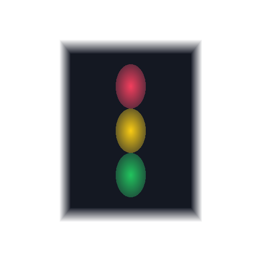

# Deva Light

**Deva Light** = Developer's Traffic Light，开发者的红绿灯。

桌面端 AI 编程助手状态监控工具，实时显示 Claude Code、Cursor 和 Codex 的运行状态。



---

## 功能特性

### 多编辑器监控

| 工具 | 监控方式 | 支持平台 |
|------|----------|----------|
| **Claude Code** | HTTP Hook 事件推送 | Windows / macOS / Linux |
| **Cursor** | HTTP Hook 事件推送 | Windows / macOS / Linux |
| **Codex** | Sessions 文件监听 | Windows / macOS |

### 项目聚合灯组

- 每个项目独立显示一组三色灯
- 项目名显示在灯组顶部
- 自动识别项目：Git root + package.json / Cargo.toml / pyproject.toml / go.mod
- **无任务时自动隐藏灯组**，有 Working / Waiting 会话时再显示
- **无活跃任务时不强制置顶**，避免空转时挡在屏幕最前

### 会话抽屉

- 同一项目多会话时，灯组右上角显示会话数角标（如 `2/3`）
- 点击灯组展开右侧抽屉面板
- 会话按优先级排序：🟡 等待操作 > 🟢 工作中 > 🔴 已完成

### 跨平台支持

| 平台 | 支持方式 |
|------|----------|
| **Windows** | 完整 GUI，NSIS/MSI 安装包 |
| **macOS** | 完整 GUI，.app/.dmg 安装包 |
| **Ubuntu/Linux** | Hook-only 模式，转发到远程 GUI |

### WSL / SSH 远程开发

- WSL 中只安装 hook 二进制，事件转发到 Windows GUI
- 支持配置**多台 SSH 主机**监控远程 Codex 会话
- 设置中可随时添加、编辑、删除 SSH 目标

---

## 状态说明

| 状态 | 颜色 | 含义 | 触发事件 |
|------|------|------|----------|
| **Working** | 🟢 绿色 | AI 正在工作中 | prompt-submit, pre-tool-use, post-tool-use, task_started |
| **Waiting** | 🟡 黄色 | 等待用户操作 | permission-request, beforeShellExecution, notification |
| **Done** | 🔴 红色 | 任务已完成 | stop, task_complete |
| **Idle** | ⚫ 空闲 | 会话启动，等待首次提示 | session-start |

---

## 安装

### Windows

1. 从 [Releases](https://github.com/wybyMrH/Deva_Light/releases) 下载最新版本
2. 运行 `Deva Light_x64-setup.exe` 安装
3. 首次启动会提示安装 Claude Code / Cursor hooks

### macOS

1. 从 [Releases](https://github.com/wybyMrH/Deva_Light/releases) 下载 `.dmg`
2. 拖拽到 Applications 文件夹
3. 首次运行可能需要在"系统偏好设置 > 安全性与隐私"中允许

### Ubuntu/Linux (Hook-only)

用于 SSH 远程开发场景，Ubuntu 只安装 hook 二进制转发事件到 Windows/macOS GUI。

```bash
curl -sL https://github.com/wybyMrH/Deva_Light/releases/latest/download/install-ubuntu-hook.sh | bash -s -- http://WINDOWS_IP:17321
```

### 应用内自动更新

安装带自动更新功能的版本后，后续升级无需重新下载安装包：

1. 启动后自动检测 GitHub Release 更新并通知
2. 托盘 → **检查更新**，或 **设置 → 关于 → 立即更新并重启**

详见 [docs/UPDATER.md](docs/UPDATER.md)。

---

## 使用方法

### 基本操作

1. **启动应用**：双击桌面图标或从开始菜单启动
2. **安装 Hooks**：设置 → 编辑器集成，安装 Claude / Cursor 集成
3. **正常使用**：使用 Claude Code、Cursor 或 Codex，灯组会自动显示状态
4. **确认状态**：点击黄灯或红灯灯组可确认并清除状态

### 右键菜单

右键点击灯组可打开菜单：

- **Open**：打开项目目录
- **Copy Path**：复制项目路径
- **Settings**：打开设置窗口
- **诊断**：打开设置 → 高级诊断面板
- **Remove**：移除灯组

### 设置

- **常规**：窗口置顶偏好（仅在有活跃任务时生效）、通知、显示模式
- **远程连接**：局域网转发、Ubuntu 安装命令、多台 SSH 主机
- **高级**：诊断信息、可点击路径打开目录、最近日志

左下角显示配置目录路径，点击可直接打开 `~/.deva_light`。

---

## 开发

### 环境要求

- Rust 1.70+
- Node.js 18+
- pnpm / npm

### 本地运行

```bash
git clone https://github.com/wybyMrH/Deva_Light.git
cd Deva_Light
npm install
npm run dev
cargo test
npm run build
```

### 处理应用图标

将设计稿保存为 `src-tauri/icons/icon.png` 后运行（会自动去除白底并生成 `.ico`）：

```bash
python3 scripts/generate_icon.py
```

### 项目结构

```
Deva_Light/
├── src-tauri/          # Tauri Rust 后端
├── src-hook/           # Hook 二进制
├── src/                # WebView 前端
├── scripts/            # 安装脚本与图标生成
├── docs/               # 文档与 README 预览图
└── .github/workflows/  # CI/CD
```

---

## 常见问题

### Q: 灯组不显示？

1. 确认有 **Working / Waiting** 状态的任务（Done 完成后灯组会自动隐藏）
2. 确认 Claude / Cursor hooks 已安装
3. 打开 **设置 → 高级 → 刷新诊断** 查看路径与日志

### Q: 诊断信息为空？

请使用 **设置 → 高级** 面板查看；主窗口右键「诊断」会直接打开该面板。

### Q: WSL / SSH 转发不工作？

1. 确认 Windows GUI 正在运行
2. 确认 HTTP Bind 设置为 `0.0.0.0`
3. SSH 需配置密钥认证；多台主机在 **设置 → 远程连接** 中分别添加

---

## License

MIT License - 详见 [LICENSE](LICENSE) 文件
