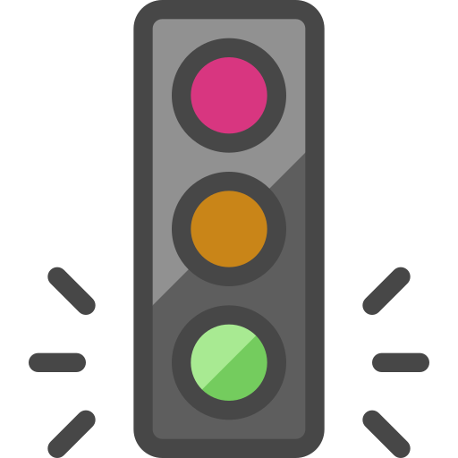
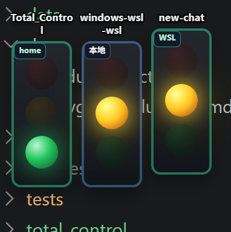

# Deva Light

**Deva Light** = Developer's Traffic Light，开发者的红绿灯。

桌面端 AI 编程助手状态监控工具，实时显示 Claude Code、Cursor 和 Codex 的运行状态。

<p align="center">
  
</p>

<p align="center">
  
</p>

---

## 功能特性

### 多编辑器监控

| 工具 | 监控方式 | 支持平台 |
|------|----------|----------|
| **Claude Code** | HTTP Hook 事件推送 | Windows / macOS / Linux |
| **Cursor** | HTTP Hook 事件推送 | Windows / macOS / Linux |
| **Codex** | Sessions 文件监听 | Windows / macOS |

### 项目聚合灯组

- 每个**项目 + 来源**独立显示一组三色灯（本地 / WSL / SSH 分开显示）
- 项目名显示在灯组上方，过长时自动换行，灯组本体**底部对齐**
- 自动识别项目：Git root + `package.json` / `Cargo.toml` / `pyproject.toml` / `tauri.conf.json`
- **无活跃任务时自动隐藏灯组**（仅 `Working` / `Waiting` 时显示）
- 无活跃任务时不强制置顶，避免空转时挡在屏幕最前

### 显示模式

| 模式 | 说明 |
|------|------|
| **并行灯组**（默认） | 每个项目各显示一盏灯；多会话时角标显示数量，点击展开会话抽屉 |
| **紧凑模式** | 只显示一盏灯，在多个项目间切换；角标显示项目总数 |

<p align="center">
  
</p>

### 会话抽屉

- 同一项目多会话时，灯组右上角显示会话数角标
- 点击灯组外壳或项目名展开右侧抽屉
- 会话按优先级排序：🟡 等待操作 > 🟢 工作中 > 🔴 已完成
- 并行模式下可点击会话 chip（C / U / X）单独确认

### 跨平台与远程

| 平台 | 支持方式 |
|------|----------|
| **Windows** | 完整 GUI，NSIS/MSI 安装包 |
| **macOS** | 完整 GUI，.app / .dmg 安装包 |
| **Ubuntu/Linux** | Hook-only 模式，转发到远程 GUI |

- WSL 中只安装 hook 二进制，事件转发到 Windows GUI
- 支持配置**多台 SSH 主机**监控远程 Codex 会话
- 灯组左上角来源标签：`本地` / `WSL` / `SSH` / `远程`

---

## 状态说明

| 状态 | 颜色 | 含义 | 视觉效果 |
|------|------|------|----------|
| **Working** | 🟢 绿色 | AI 正在工作中 | 常亮 |
| **Waiting** | 🟡 黄色 | 等待用户操作（权限、命令确认等） | 柔和呼吸频闪 |
| **Done** | 🔴 红色 | 任务已完成 | 常亮 |
| **Idle** | — | 会话空闲，等待首次提示 | 不显示灯组 |

常见触发事件：

- **Working**：`prompt-submit`、`pre-tool-use`、`task_started` 等
- **Waiting**：`permission-request`、`beforeShellExecution`、Cursor `pre-tool-use` 等
- **Done**：`stop`、`task_complete`、`session-end` 等

---

## 安装

### Windows

1. 从 [Releases](https://github.com/wybyMrH/Deva_Light/releases) 下载最新版本
2. 运行 `Deva Light_x64-setup.exe` 安装
3. 首次启动会提示安装 Claude Code / Cursor hooks

### macOS

1. 从 [Releases](https://github.com/wybyMrH/Deva_Light/releases) 下载 `.dmg`
2. 拖拽到 Applications 文件夹
3. 首次运行可能需要在「系统偏好设置 → 安全性与隐私」中允许

### Ubuntu/Linux（Hook-only）

用于 SSH 远程开发场景，Ubuntu 只安装 hook 二进制，事件转发到 Windows/macOS GUI：

```bash
curl -sL https://github.com/wybyMrH/Deva_Light/releases/latest/download/install-ubuntu-hook.sh | bash -s -- http://WINDOWS_IP:17321
```

### 应用内自动更新

1. 启动后自动检测 GitHub Release 更新并通知
2. 托盘 → **检查更新**，或 **设置 → 关于 → 立即更新并重启**

详见 [docs/UPDATER.md](docs/UPDATER.md)。

---

## 使用指南

### 1. 首次配置

1. **启动应用**：双击桌面图标或从开始菜单启动
2. **安装 Hooks**：设置 → **编辑器集成** → 安装 Claude / Cursor 集成
3. **选择显示模式**：设置 → **常规** → 并行灯组 / 紧凑模式
4. **正常使用**：在 Claude Code、Cursor 或 Codex 中发起任务，灯组会自动出现

### 2. 灯组交互

| 操作 | 效果 |
|------|------|
| **拖动灯组** | 移动整个悬浮窗 |
| **点击亮起的黄/红灯** | 确认已处理，灯组消失 |
| **点击灯组外壳 / 项目名**（多会话） | 展开 / 收起会话抽屉 |
| **点击角标** | 并行模式：展开会话列表；紧凑模式：打开项目列表 |
| **右键灯组** | 打开、复制路径、设置、诊断、移除 |
| **右键待机灯**（无任务时） | 设置、检查更新、诊断、退出 |

> 注意：只有**点击亮起的灯珠**才会确认状态；点击项目名或外壳不会误触消除。

### 3. 并行模式多工具

同一项目若同时有 Claude Code、Cursor、Codex 任务：

- 灯组显示综合优先级最高的状态
- 灯组内小 chip 标识各会话：`C` Claude、`U` Cursor、`X` Codex
- chip 颜色对应当前会话状态；黄色 chip 同样有柔和频闪

### 4. 设置面板

| 面板 | 内容 |
|------|------|
| **常规** | 窗口置顶、通知、显示模式、Codex 手动路径 |
| **编辑器集成** | 安装 / 移除 Claude、Cursor hooks |
| **远程连接** | HTTP 绑定地址、局域网转发、SSH 主机列表 |
| **关于** | 版本号、检查更新、日志路径提示 |
| **高级** | 诊断信息、刷新诊断、打开日志目录 |

左下角状态栏显示操作结果；配置与日志目录：`~/.deva_light`（Windows：`%USERPROFILE%\.deva_light`）。

### 5. WSL / SSH 远程 Codex

1. Windows 端运行 Deva Light GUI
2. 设置 → **远程连接** → HTTP Bind 设为 `0.0.0.0`
3. WSL：按提示安装 hook，事件自动转发
4. SSH：添加 `user@host`，需配置密钥认证（非交互 BatchMode）
5. 远程 Codex 会话目录自动发现，支持 `CODEX_HOME` 环境变量

---

## 开发

### 环境要求

- Rust 1.70+
- Node.js 18+
- pnpm / npm

### 本地运行

```bash
git clone https://github.com/wybyMrH/Deva_Light.git
cd Deva_Light
npm install
npm run dev
cargo test
npm run build
```

### 处理应用图标

将设计稿保存为 `src-tauri/icons/icon.png` 后运行（会自动去除白底并生成 `.ico`）：

```bash
python3 scripts/generate_icon.py
```

### 项目结构

```
Deva_Light/
├── src-tauri/          # Tauri Rust 后端
├── src-hook/           # Hook 二进制
├── src/                # WebView 前端
├── scripts/            # 安装脚本与图标生成
├── docs/               # 文档与 README 预览图
└── .github/workflows/  # CI/CD
```

---

## 常见问题

### Q: 灯组不显示？

1. 确认有 **Working / Waiting** 状态的任务（Done 确认后灯组会自动隐藏）
2. 确认 Claude / Cursor hooks 已安装
3. 打开 **设置 → 高级 → 刷新诊断** 查看路径与日志

### Q: 莫名其妙多出几盏灯？

常见原因：

- **不同来源分开显示**：同一仓库在本地与 WSL 各有一盏灯（左上角标签不同）
- **重启后恢复会话**：Codex / Cursor 会从会话文件恢复最近活跃任务

若确认是误恢复的旧会话，点击**亮起的黄/红灯**即可清除；新版本已收紧恢复条件，减少误报。

### Q: 点击灯组后灯消失了？

黄/红灯需要**明确点击亮起的灯珠**才会确认。若仍意外消失，请检查是否点到了灯珠本身。

### Q: 灯组没有对齐？

项目名换行时，灯组本体应底部对齐。若版本较旧请更新到最新 Release。

### Q: 诊断信息为空？

请使用 **设置 → 高级** 面板；主窗口右键「诊断」会直接打开该面板。

### Q: WSL / SSH 转发不工作？

1. 确认 Windows GUI 正在运行
2. 确认 HTTP Bind 设置为 `0.0.0.0`
3. SSH 需配置密钥认证；多台主机在 **设置 → 远程连接** 中分别添加

---

## License

MIT License — 详见 [LICENSE](LICENSE)
